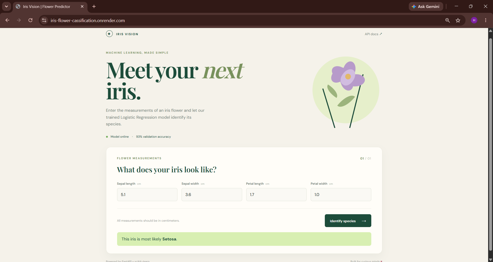

# Iris Flower Classification

<p align="center">
  
</p>

<p align="center">
  <strong>A machine-learning-powered FastAPI application that predicts the species of an iris flower from its sepal and petal measurements.</strong>
</p>

<p align="center">
  <a href="https://iris-flower-cassification.onrender.com/"><strong>Live Demo</strong></a>
  &nbsp; · &nbsp;
  <a href="https://iris-flower-cassification.onrender.com/docs"><strong>API Documentation</strong></a>
  &nbsp; · &nbsp;
  <a href="https://github.com/HKGuptha1107/QSkill-Iris-Flower-Cassification"><strong>Repository</strong></a>
</p>

## Project Overview

This project was developed as part of my QSkill internship to demonstrate an end-to-end machine learning workflow:

1. Process and explore the Iris dataset.
2. Train multiple classification algorithms.
3. Save the trained models with Joblib.
4. Evaluate the models on a reproducible test split.
5. Expose predictions through a FastAPI REST API.
6. Provide a responsive web interface for users.
7. Deploy the application on Render.

The deployed application uses the Logistic Regression model for interactive predictions and provides API documentation through FastAPI's Swagger UI.

## Live Application

Visit the working application:

**[https://iris-flower-cassification.onrender.com/](https://iris-flower-cassification.onrender.com/)**

The web interface accepts these measurements in centimeters:

- Sepal length
- Sepal width
- Petal length
- Petal width

The model predicts one of the three Iris species:

- Setosa
- Versicolor
- Virginica

## Model Evaluation

All models were evaluated using the same reproducible 20% stratified test split.

| Model | Accuracy | Precision | Recall | Weighted F1 |
| --- | ---: | ---: | ---: | ---: |
| Logistic Regression | 93.3% | 93.3% | 93.3% | 93.3% |
| K-Nearest Neighbors | 93.3% | **94.4%** | 93.3% | 93.3% |
| Decision Tree | 93.3% | 93.3% | 93.3% | 93.3% |

The deployed API uses Logistic Regression because it provides strong, balanced performance and is efficient for real-time inference.

## Technology Stack

- **Python**
- **FastAPI** for the REST API
- **Uvicorn** for the development server
- **Pandas** for data processing
- **Scikit-learn** for model training and evaluation
- **Joblib** for model persistence
- **Pydantic** for request validation
- **HTML, CSS, and JavaScript** for the frontend
- **Render** for deployment

## Project Structure

```text
QSkill-Iris-Flower-Cassification/
├── data/
│   └── iris_processed.csv
├── images/
│   ├── project_image.png
│   ├── feature_compare.png
│   ├── feature_dist.png
│   ├── relation_features.png
│   └── corrleation_data.png
├── models/
│   ├── logistic_regression.pkl
│   ├── KNN.pkl
│   └── decision_tree.pkl
├── src/
│   ├── app.py
│   ├── evaluate.py
│   ├── training.py
│   ├── predict.py
│   ├── processed_data.py
│   ├── EDA.py
│   └── web/
│       ├── index.html
│       └── static/
│           ├── app.js
│           └── styles.css
├── requirements.txt
└── README.md
```

## Run Locally

### 1. Clone the repository

```bash
git clone https://github.com/HKGuptha1107/QSkill-Iris-Flower-Cassification.git
cd QSkill-Iris-Flower-Cassification
```

### 2. Create and activate a virtual environment

**Windows PowerShell**

```powershell
py -m venv .venv
.venv\Scripts\Activate.ps1
```

**macOS/Linux**

```bash
python3 -m venv .venv
source .venv/bin/activate
```

### 3. Install dependencies

```bash
pip install -r requirements.txt
```

### 4. Start the application

From the project root:

```bash
python -m uvicorn src.app:app --reload
```

Open the local application at <http://127.0.0.1:8000/>.

## API Reference

### Health check

```http
GET /health
```

### Prediction

```http
POST /predict
Content-Type: application/json
```

Example request:

```json
{
  "sepal_length": 5.1,
  "sepal_width": 3.5,
  "petal_length": 1.4,
  "petal_width": 0.2
}
```

Example response:

```json
{
  "message": "Prediction Result",
  "Result": "setosa",
  "model": "LogisticRegression",
  "input": {
    "sepal_length": 5.1,
    "sepal_width": 3.5,
    "petal_length": 1.4,
    "petal_width": 0.2
  }
}
```

Interactive Swagger documentation is available at `/docs`.

## Evaluate the Models

To evaluate all three saved models locally:

```bash
python src/evaluate.py
```

The evaluation script prints each model's classification report and confusion matrix, followed by a ranked comparison of accuracy, precision, recall, and F1 score.

## Training the Models

To retrain and save all three models:

```bash
python src/training.py
```

The trained model files are written to the `models/` directory.

## Portfolio Links

- **Project repository:** [HKGuptha1107/QSkill-Iris-Flower-Cassification](https://github.com/HKGuptha1107/QSkill-Iris-Flower-Cassification)
- **Primary GitHub profile:** [Herambha1226](https://github.com/Herambha1226)
- **Live project:** [iris-flower-cassification.onrender.com](https://iris-flower-cassification.onrender.com/)

## Future Improvements

- Add prediction confidence probabilities to the API response.
- Add automated tests for API validation and model predictions.
- Add model versioning and experiment tracking.
- Add a Dockerfile for repeatable deployment.
- Add richer visualizations and dataset exploration to the web interface.

## License

This project was created for educational and internship purposes.
